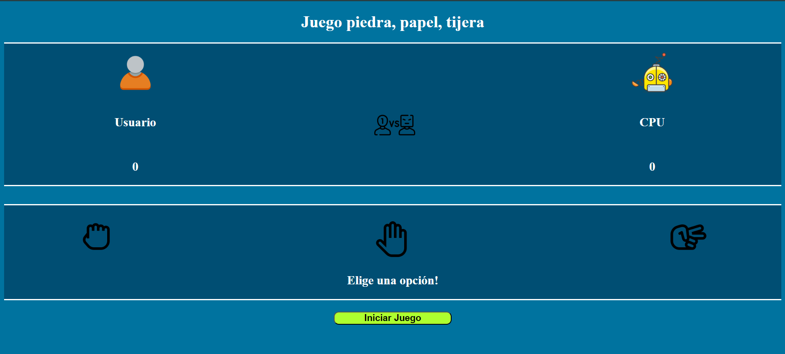
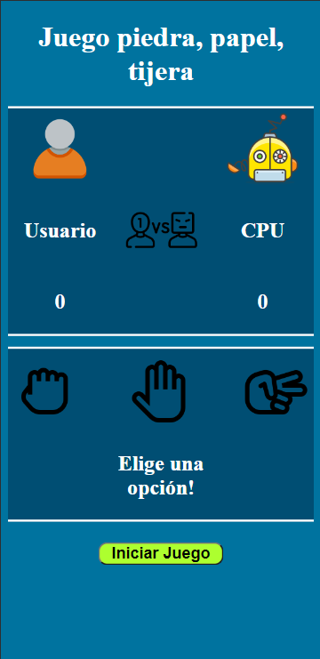

# Juego Piedra Papel o Tijera
Este proyecto implementa el clásico juego de Piedra, Papel o Tijeras utilizando HTML, CSS y JavaScript. El juego permite al jugador competir versus la máquina, seleccionando una de las tres opciones: piedra, papel o tijeras. El ganador se determina según las reglas tradicionales del juego.

## Ver está página:
https://alvaromatias2.github.io/Piedra-Papel-o-Tijeras/

## Tecnologías utilizadas:
- HTML
- CSS
- Responsive Design (Siguiendo la metodología de Mobile First)
- JavaScript

## Funcionamiento:
Funciona de la siguiente manera: tienes que elegir una opción (eliges haciendo click sobre la opción) en este caso "piedra", "papel" o "tijera". Una vez elegida la opción con la que quieres jugar das un click en el butón que dice iniciar juego. Al hacerlo, se desplegará una alerta que indica si gana el jugador, la máquina ol es un empate, además se modificará el score según el resultado luego de cerrar el alert.

## Habilidades adquiridas: 
Realizar diseño responsivo
Utilización de recursos de imágen
Creacion de algoritmo que controla la lógica del juego.

## Imágenes:
- Tamaño escrito:

- Tamaño Mobile

### Creado por @alvaromatias2